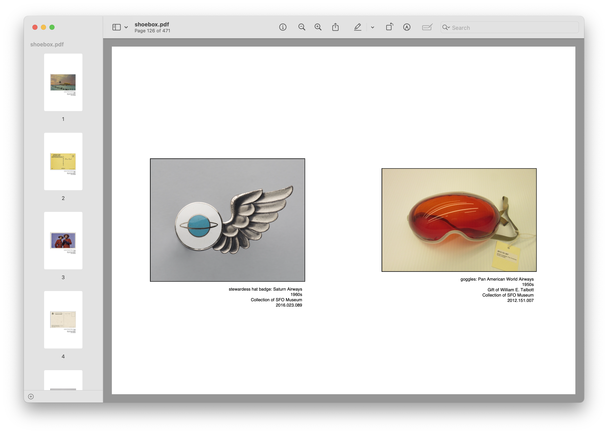
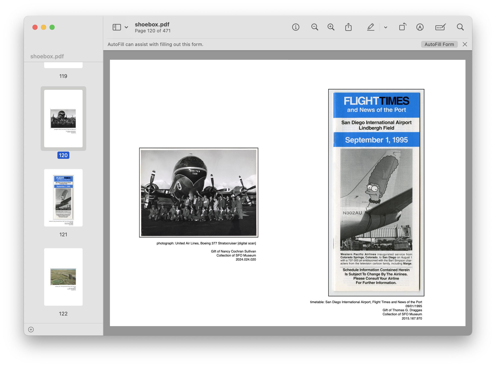

# go-picturebook-sfomuseum

Go application to create a "picturebook" using the SFO Museum API.

## Description

This package enables support for creating "picturebooks" – a PDF file created from a set of images – using the SFO Museum API and the [aaronland/go-picturebook](https://github.com/aaronland/go-picturebook) package. It was created to demonstrate the use of the [SFO Museum API](https://api.sfomuseum.org) and the [sfomuseum/go-sfomuseum-api](https://github.com/sfomuseum/go-sfomuseum-api) package.

Currently, it is only capable of producing "picturebooks" derived from a SFO Museum "shoebox" but in the future it will be able to create picturebooks from arbitrary API calls.

## Creating a "picturebook" of items in your SFO Museum "shoebox"

The `aaronland/go-picturebook` package is designed to create one-image-per-page PDF files from a set of images. Those images as well as things like their captions or descriptive texts are derived from a number of different "handlers". Consult the [aaronland/go-picturebook documentation](https://github.com/aaronland/go-picturebook?tab=readme-ov-file#handlers) for a complete list of default handlers and their uses.

This package enables a "bucket" and "caption" handler for deriving images and their captions from a SFO Museum "shoebox". Consult the [Mills Field weblog posts tagged "shoebox"](https://millsfield.sfomuseum.org/blog/tags/shoebox) for details about what a SFO Museum "shoebox" is and how to use it.

This package provides a commandline `picturebook` application, described below, which enables these handlers below.

## Tools

```
$> make cli
go build -mod vendor -ldflags="-s -w" -o bin/picturebook cmd/picturebook/main.go
```

### picturebook

A commandline tool for creating a "picturebook"-style PDF file from a SFO Museum "shoebox".

```
$> ./bin/picturebook -h
  -access-token string
    	A valid SFO Museum API access token to retrieve your shoebox items (must have "read" permissions).
  -bleed float
    	An additional bleed area to add (on all four sides) to the size of your picturebook.
  -border float
    	The size of the border around images. (default 0.01)
  -dpi float
    	The DPI (dots per inch) resolution for your picturebook. (default 150)
  -even-only
    	Only include images on even-numbered pages.
  -filename string
    	The filename (path) for your picturebook. (default "shoebox.pdf")
  -fill-page
    	If necessary rotate image 90 degrees to use the most available page space. Note that any '-process' flags involving colour space manipulation will automatically be applied to images after they have been rotated.
  -height float
    	A custom width to use as the size of your picturebook. Units are defined in inches by default. This flag overrides the -size flag when used in combination with the -width flag.
  -margin float
    	The margin around all sides of a page. If non-zero this value will be used to populate all the other -margin-(N) flags.
  -margin-bottom float
    	The margin around the bottom of each page. (default 1)
  -margin-left float
    	The margin around the left-hand side of each page. (default 1)
  -margin-right float
    	The margin around the right-hand side of each page. (default 1)
  -margin-top float
    	The margin around the top of each page. (default 1)
  -max-pages int
    	An optional value to indicate that a picturebook should not exceed this number of pages
  -odd-only
    	Only include images on odd-numbered pages.
  -orientation string
    	The orientation of your picturebook. Valid orientations are: 'P' and 'L' for portrait and landscape mode respectively. (default "P")
  -size string
    	A common paper size to use for the size of your picturebook. Valid sizes are: "a3", "a4", "a5", "letter", "legal", or "tabloid". (default "letter")
  -target-uri string
    	
  -units string
    	The unit of measurement to apply to the -height and -width flags. Valid options are inches, millimeters, centimeters (default "inches")
  -verbose
    	Display verbose output as the picturebook is created.
  -width float
    	A custom height to use as the size of your picturebook. Units are defined in inches by default. This flag overrides the -size flag when used in combination with the -height flag.
```

#### Example

To create a shoebox "picturebook" that is 6 inches wide and 9 inches tall you might do something like this:

```
$> ./bin/picturebook \
	-width 6 \
	-height 9 \
	-access-token {SFOMUSEUM_API_ACCESS_TOKEN}
```

Which would create a document that looks "like" this:



Each object image will include a caption like this:

```
goggles: Pan American World Airways
1950s
Gift of William E. Talbott
Collection of SFO Museum
2012.151.007
```

#### Notes and caveats

As of this writing only [SFO Museum Aviation Collection objects](https://collection.sfomuseum.org) are included in "shoebox picturebooks". Support for other types of shoebox items (Instagram posts, flights to and from SFO) will be added in subsequent releases.

As of this writing there is an outstanding issue in the [aaronland/go-picturebook](https://github.com/aaronland/go-picturebook) package where the maximum height of an image relative to the bottom margin of a page is _not_ calculated factoring in the total height of that image's caption. This can yield results that are a bit "wonky" and inelegant, like this:



There is an [open issue](https://github.com/aaronland/go-picturebook/issues/49) for this problem.

## Creating a SFO Museum API acccess token

The easiest and fastest way to create a SFO Museum API access token is to use the handy [Create a new access token for yourself](https://api.sfomuseum.org/oauth2/authenticate/like-magic/) webpage.

## See also

* https://github.com/aaronland/go-picturebook
* https://github.com/sfomuseum/go-sfomuseum-api
* https://you.sfomuseum.org
* https://api.sfomuseum.org